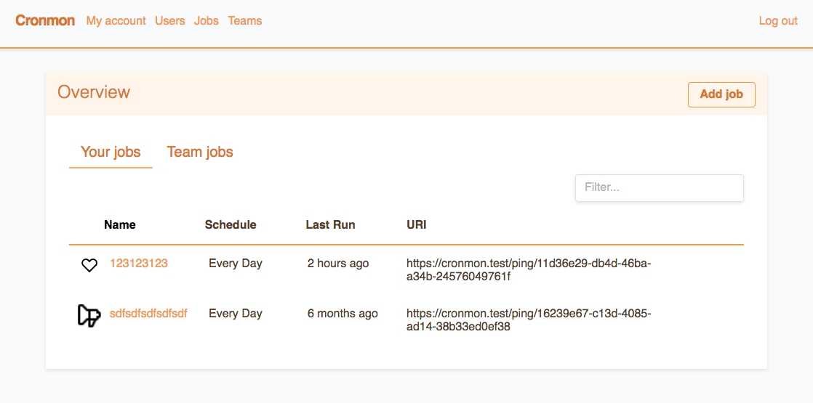

# Cronmon

[](https://travis-ci.org/ohnotnow/cronmon)

A PHP web app to monitor & alert cron jobs using a simple http api.  It allows users to create job entries
with given periods and grace windows.  Then their scheduled tasks can do a simple HTTP GET to the
unique URI generated each time they run.  If a job doesn't call in within the given grace window
then an alert is sent to the user.



## Features

Users can silence particular jobs (maybe a server is going offline for maintenence) or can
silence their whole account (maybe they are going on holiday or know all their servers will be
offline for a power-cut etc).

A sysadmin can also silence the whole site - which can be useful
if there's going to be a widespread maintenence period, for instance.  That way jobs are still recorded,
just no alerts are sent.  Sysadmins can also view/edit any job or user on the system which can be useful
if a job starts going 'alert crazy'.

Users can also over-ride the email address for particular jobs.  So maybe a specific backup job goes to person X, a particular facility/office jobs should go to a mailing list, etc. You can also have a 'fallback' email address which will start to get notified if a job has been alerting for a long while.

Users can create teams and allocate jobs/users to the teams.  This allows other members of the
team to view & edit any jobs which are in their team(s).

HTTP "Pings" can also pass a "data" field to record extra information against the record.  This can
be used to record, for instance, an exit code or amount of data transferred.

You can also create/update jobs via a simple HTTP API.

## Requirements

See the [Laravel requirements](https://laravel.com/docs/6.0/installation#server-requirements) page.  You also
need a valid mail server to send the alerts.  You will probably need an SQL server - although you
can use SQLite if you have a small install.

## Docker demo

If you have docker available you _should_ be able to run :

```
export CRONMON_ADMIN_USERNAME=whatever
export CRONMON_ADMIN_EMAIL=whatever@example.com
export CRONMON_ADMIN_PASSWORD=mysecretpassword
docker-compose up
```

Then the test app will be available at http://localhost:3000/ and all email is redirected to a copy of [Mailhog](https://github.com/mailhog/MailHog) running at http://localhost:3025/.

## Regular Installation

Clone the repository into a new folder.  Then in the new directory run :

```
cp .env.example .env
composer install
php artisan key:generate
```
If you don't have composer already then you can download it from https://getcomposer.org/ .

You will also need to point a webserver vhost with `${your_directory}/public` as it's document root.

Then edit the .env file to suit your environment (email server etc).  Then run the database migrations to create the tables :
```
php artisan migrate
```

Once you are ready you can create an initial admin account by running :
```
php artisan cronmon:createadmin username your-email@whatever.com
```
You should be sent a password reset link by email which will let you set a password and log in.

## Production Docker

You should be able to run this inside swarm/kubernetes without too much problem.  There is an example stack file for Docker swarm as `prod-stack.yml`.  To go through the steps manually :
```
export PHP_VERSION=7.3
export IMAGE_NAME=cronmon
export DOTENV_NAME=cronmon-dotenv-1
cat .env | docker secret create ${DOTENV_NAME} -
docker build --target=prod -t $IMAGE_NAME .
docker stack deploy -c prod-stack.yml cronmon
```
If you want to automatically create the initial admin user you can either use environment variables or secrets.  The enviroment variables it looks for are :
```
CRONMON_ADMIN_USERNAME=whatever
CRONMON_ADMIN_EMAIL=whatever@example.com
CRONMON_ADMIN_PASSWORD=mysecretpassword
```
or to use files (eg, Docker secrets) :
```
# docker secret create cronmon_username_1 "whatever"
# docker secret create cronmon_email_1 "whatever@example.com"
# docker secret create cronmon_password_1 "mysecretpassword"
CRONMON_ADMIN_USERNAME_FILE=/run/secrets/cronmon_username_1
CRONMON_ADMIN_EMAIL_FILE=/run/secrets/cronmon_email_1
CRONMON_ADMIN_PASSWORD_FILE=/run/secrets/cronmon_password_1
```

## Updating

If you haved pulled down an updated version (by eg, `git pull origin master`) then you probably want to run :

```
composer update
php artisan config:clear
php artisan cache:clear
php artisan view:clear
php artisan migrate
```

That will clear out most of the cached/pre-compiled bits from the older copy and add any new fields to the database.

## Running the checks

To manually run the checks for the jobs in the system you can call :
```
php artisan cronmon:checkjobs
```
(Tip: if you're just testing things out you can set your .env 'MAIL_DRIVER=log' - then the email is written to 'storage/logs/laravel.log' rather than via smtp)

In production you can set up a cron job to call laravel's scheduler which will then call the cronmon:checkjobs command
itself.  See the [laravel docs](https://laravel.com/docs/5.3/scheduling) for instructions.  By default the
checks are run every five minutes.  If you want to change that then edit `app/Console/Kernel.php` in the schedule()
method.  Again the laravel docs have some guidence for what you can do.

By default the alerts will only be sent to the user every 60 minutes.  That's so they don't get bombarded with
notifications every five minutes about a job that's failed to run.  If you want to alter that you can change the
'alert_interval' value in config/cronmon.php.  You can also change the prefix of the email alert there too - by
default it's '[CRONMON]'.

In that config file you can also change the default number of hours a job can fail for before it is sent to any 'fallback' email address for the job.  This is useful when, for instance, the primary user should get notified right away, but the 'fallback' will start to get notified if they haven't dealt with things after some time.  The default is 24hrs.

If you want to change things about the actual email that is sent, have a look at `app/Notifications/JobHasGoneAwol.php`.
Also have a read of the the laravel [notification docs](https://laravel.com/docs/5.3/notifications).

## Truncating the logs

You can manually truncate the logs for each job 'ping' (ie, each hit from the http call) by running :
```
php artisan cronmon:truncatepings
```
If you enable the scheduler as detailed above then this is automatically run once a week.  By default it
will keep 100 records for each job.  You can alter that by changing 'keep_pings' in 'config/cronmon.php'.

## Using the checks

To actually notify the app that a job has run, you sent a straight http get to it's URI (shown in the app).  For
instance, you create a job that shows it's URI as 'http://cronmon.dev:8000/ping/c6ad9b87-f945-440e-bc90-c0bc8794f52a'.
At the end of a bash script you could use `curl` to 'ping' the app which will update it's status.  A *very* basic
example might be :
```
#!/bin/bash

# basic exit on error
set -e

# do something
rsync -a /home/me /mnt/usb/backup

# now ping the app to let it know we ran ok
curl -s http://cronmon.dev:8000/ping/c6ad9b87-f945-440e-bc90-c0bc8794f52a
```
When you are viewing a particular job in the app it will show some copy'n'paste examples for pinging it from a
few common scripting languages too.

If you want to send extra data along with your check, pass a "data" field with the information, eg :
```
curl -s http://cronmon.dev:8000/ping/c6ad9b87-f945-440e-bc90-c0bc8794f52a?data=exitcode=44
curl -X POST -F "data=exitcode=44" -s http://cronmon.dev:8000/ping/c6ad9b87-f945-440e-bc90-c0bc8794f52a
```

## Creating/updating jobs via an API call

Users can create an API key in their 'My Account' page (pick Edit -> tick 'generate new api key').  They can then use
that key to create or update a cron job in the system.  Eg :
```
curl -X POST -H "Accept: application/json" -H "Content-Type: application/json" \
  --data '{"name": "my new job", "schedule": "1 1 * * *", "api_key": "saldkj13240123nesdjna"}' \
  http://cronmon.dev/api/cronjob
```

The parameters you can set are :
```
"name" - name of the job (existing or create a new one)
"schedule" - the cron-format you want to use
"team" - name of the team to associate with this job
"grace" - amount of time for the grace period (number)
"grace_units" - the units the grace period is set ('minute' ,'hour', 'day', 'week')
"period" - the frequency of the job (if you are not setting the 'schedule') - number
"period_units" - units for the frequency  ('minute' ,'hour', 'day', 'week')
```

You must pass a name and your API key and either a schedule _or_ the period & period_units.

## Silencing the whole site

This can be useful if you know there will be a long maintenance window or
a network outage for instance.  To silence or un-silence the whole site
you can run :
```
php artisan cronmon:silence
php artisan cronmon:unsilence
```

## Tests

You can run the test suite by running `vendor/bin/phpunit`.  It should cover most of the functionality.

## Why not use PackageX which does the same...

There are quite a few SaaS which offer this kind of service.  But we needed
something on-site as a large percentage of our servers aren't internet-facing,
so a 'cloud' SaaS was fairly useless to us.

Most of the on-site/opensource packages I could find were either in languages
/ frameworks that I'm not hugely familiar with (certainly not to the extent I could confidently make needed modifications) or used a specific DB backend which we don't currently run.

So I guess you could look on this as ideal if you're after an on-prem, relatively database-agnostic and can rustle up a server which can serve PHP.

### Todo :

* Do something meaningful with the 'ping' logs for jobs.
* DONE Possibly create an API for creating/editing jobs so it could be automated as part of a provisioning system, for instance.
